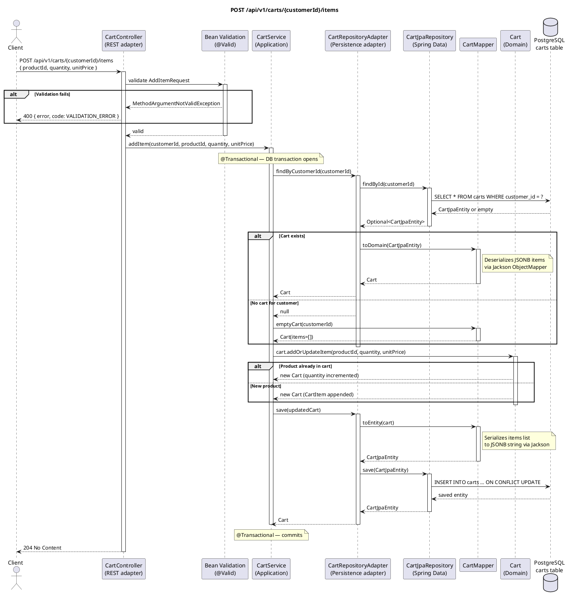

# POST /api/v1/carts/{customerId}/items — Add Item to Cart

## Overview

Adds a product to the customer's cart. If the product is already present, its quantity is incremented.
If the customer has no cart yet, one is created on the fly. Always returns **204 No Content**.

---

## Request

| Part | Detail |
|------|--------|
| Method | `POST` |
| Path | `/api/v1/carts/{customerId}/items` |
| Path param | `customerId` — UUID of the customer |
| Content-Type | `application/json` |

**Body — `AddItemRequest`:**

```json
{
  "productId": "uuid",
  "quantity": 2,
  "unitPrice": 19.99
}
```

| Field | Type | Constraint |
|-------|------|-----------|
| `productId` | UUID | `@NotNull` |
| `quantity` | Int | `@Min(1)` |
| `unitPrice` | BigDecimal | `@NotNull` |

---

## Detailed Flow

### 1. HTTP layer — `CartController.addItem()`

- Spring deserializes the JSON body into `AddItemRequest`.
- `@Valid` triggers Bean Validation. If any constraint is violated, Spring throws `MethodArgumentNotValidException` **before the controller method body executes** — see [Error Handling](#error-handling).
- The controller extracts `customerId` from the path and delegates to the inbound port:

```kotlin
cartUseCase.addItem(customerId, request.productId, request.quantity, request.unitPrice)
```

### 2. Application layer — `CartService.addItem()` (`@Transactional`)

A Spring transaction is opened.

#### 2a. Load or create cart

```kotlin
val cart = cartRepository.findByCustomerId(customerId)
    ?: cartMapper.emptyCart(customerId)
```

- Calls the outbound port `CartRepository.findByCustomerId()`.
- If no cart exists for the customer, `cartMapper.emptyCart()` constructs an in-memory `Cart` with an empty items list — nothing is written to the DB yet.

#### 2b. Outbound adapter — `CartRepositoryAdapter.findByCustomerId()`

```kotlin
cartJpaRepository.findById(customerId).map { cartMapper.toDomain(it) }.orElse(null)
```

- Spring Data JPA issues `SELECT * FROM carts WHERE customer_id = ?`.
- If a row is found, `CartMapper.toDomain()` deserializes the `items` JSONB column into a `List<CartItem>` using Jackson.
- Returns `null` if no row exists.

#### 2c. Domain logic — `Cart.addOrUpdateItem()`

```kotlin
val updated = cart.addOrUpdateItem(productId, quantity, unitPrice)
```

The `Cart` domain model (pure Kotlin, no Spring/JPA) applies the business rule:

- **Product already in cart** → creates a new list with the existing `CartItem` copied with `quantity + requested quantity`.
- **Product not in cart** → appends a new `CartItem(productId, quantity, unitPrice)`.

Both branches return a **new immutable `Cart`** with a refreshed `updatedAt = Instant.now()`.

#### 2d. Persist — `CartRepositoryAdapter.save()`

```kotlin
cartRepository.save(updated)
```

- `CartMapper.toEntity()` serializes `cart.items` back to a JSON string via Jackson and wraps it in `CartJpaEntity`.
- `CartJpaRepository.save()` (Spring Data) issues an `INSERT … ON CONFLICT UPDATE` (upsert via JPA merge).
- The saved entity is mapped back to a domain `Cart` and returned (the return value is ignored by `CartService`).

Spring commits the transaction.

### 3. Response

The controller returns `ResponseEntity.noContent().build()` → **HTTP 204 No Content**.

---

## Error Handling

| Scenario | Exception | Handler | HTTP Response |
|----------|-----------|---------|---------------|
| `productId` is null | `MethodArgumentNotValidException` | `GlobalExceptionHandler.handleValidation()` | `400` `{"error": "productId: must not be null", "code": "VALIDATION_ERROR"}` |
| `quantity` < 1 | `MethodArgumentNotValidException` | `GlobalExceptionHandler.handleValidation()` | `400` `{"error": "quantity: must be greater than or equal to 1", "code": "VALIDATION_ERROR"}` |
| `unitPrice` is null | `MethodArgumentNotValidException` | `GlobalExceptionHandler.handleValidation()` | `400` `{"error": "unitPrice: must not be null", "code": "VALIDATION_ERROR"}` |
| DB unreachable | `DataAccessException` (unchecked) | Not explicitly handled — propagates as `500` | `500 Internal Server Error` |

> **Note:** `CartNotFoundException` is defined but is **never thrown** in this flow — a missing cart results in a silent creation of an empty cart.

---

## PlantUML Sequence Diagram


