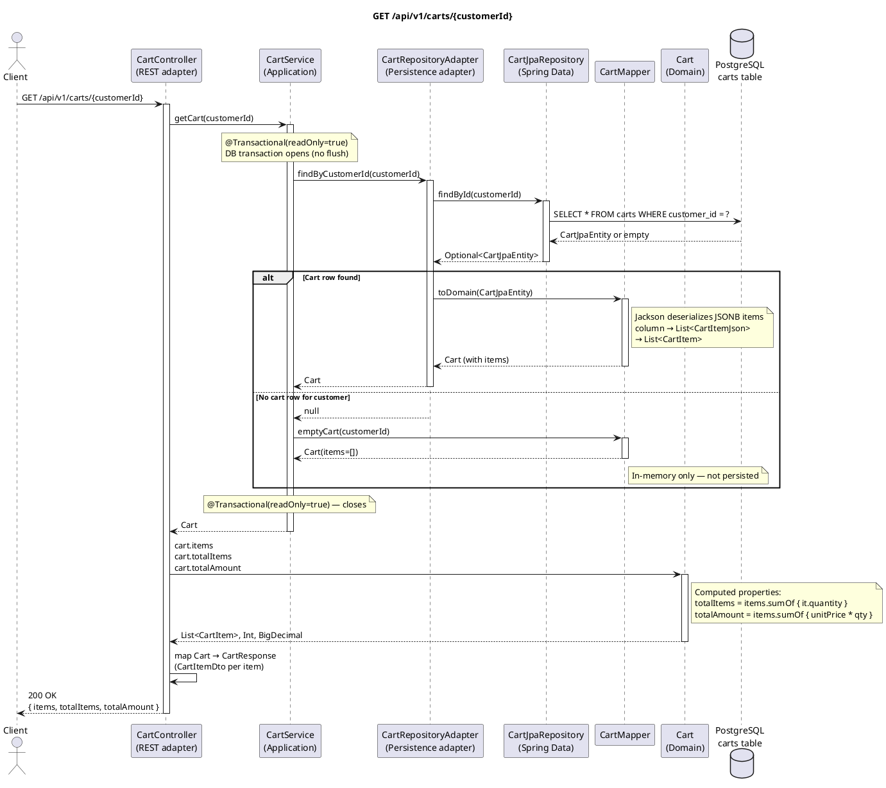

# GET /api/v1/carts/{customerId} — Retrieve Cart

## Overview

Returns the current state of a customer's cart. If the customer has no cart, an **empty cart is returned** (not a 404). The response includes a flat list of items plus two computed aggregates: `totalItems` and `totalAmount`.

Always returns **200 OK**.

---

## Request

| Part | Detail |
|------|--------|
| Method | `GET` |
| Path | `/api/v1/carts/{customerId}` |
| Path param | `customerId` — UUID of the customer |
| Body | None |

---

## Response — `CartResponse`

```json
{
  "items": [
    {
      "productId": "uuid",
      "quantity": 2,
      "unitPrice": 19.99
    }
  ],
  "totalItems": 2,
  "totalAmount": 39.98
}
```

| Field | Type | Description |
|-------|------|-------------|
| `items` | `List<CartItemDto>` | One entry per distinct product in the cart |
| `totalItems` | Int | Sum of all item quantities (`items.sumOf { it.quantity }`) |
| `totalAmount` | BigDecimal | Sum of `unitPrice × quantity` across all items |

**Empty cart response:**

```json
{
  "items": [],
  "totalItems": 0,
  "totalAmount": 0
}
```

---

## Detailed Flow

### 1. HTTP layer — `CartController.getCart()`

- No request body or validation is needed.
- The controller extracts `customerId` from the path and delegates to the inbound port:

```kotlin
val cart = cartUseCase.getCart(customerId)
```

After receiving the domain `Cart`, the controller manually maps it to `CartResponse`:

```kotlin
CartResponse(
    items = cart.items.map { CartItemDto(it.productId, it.quantity, it.unitPrice) },
    totalItems = cart.totalItems,
    totalAmount = cart.totalAmount
)
```

`totalItems` and `totalAmount` are **computed properties** on the `Cart` domain object — no extra calculation happens in the controller.

### 2. Application layer — `CartService.getCart()` (`@Transactional(readOnly = true)`)

A read-only Spring transaction is opened (no dirty-checking overhead, Hibernate flush mode NEVER).

```kotlin
return cartRepository.findByCustomerId(customerId)
    ?: cartMapper.emptyCart(customerId)
```

- Calls the outbound port. If a row exists, returns the deserialized `Cart`.
- If no row exists, `cartMapper.emptyCart(customerId)` returns `Cart(customerId, items=[], updatedAt=now)`. This object is **never persisted** — it exists only for the duration of this request.

### 3. Outbound adapter — `CartRepositoryAdapter.findByCustomerId()`

```kotlin
cartJpaRepository.findById(customerId).map { cartMapper.toDomain(it) }.orElse(null)
```

- Spring Data JPA issues `SELECT * FROM carts WHERE customer_id = ?`.
- If found: `CartMapper.toDomain()` deserializes the `items` JSONB column.

  Inside `toDomain()`, Jackson reads the JSON array into `List<CartItemJson>`, then each element is mapped to a `CartItem` value object:

  ```kotlin
  Cart(
      customerId = entity.customerId,
      items = items.map { CartItem(it.productId, it.quantity, it.unitPrice) },
      updatedAt = entity.updatedAt
  )
  ```

- If not found: returns `null`, and `CartService` substitutes an empty cart.

### 4. Domain computed properties

Back in `CartService`, the `Cart` object is returned as-is to the controller. Two properties are evaluated lazily when the controller accesses them:

```kotlin
val totalItems: Int get() = items.sumOf { it.quantity }
val totalAmount: BigDecimal get() = items.sumOf { it.unitPrice * it.quantity.toBigDecimal() }
```

These are pure functions over the immutable `items` list — no database round-trip.

### 5. Response

The controller returns `ResponseEntity.ok(cartResponse)` → **HTTP 200 OK** with the JSON body.

---

## Error Handling

| Scenario | Exception | Handler | HTTP Response |
|----------|-----------|---------|---------------|
| Customer has no cart | *(no exception)* | — | `200` with empty cart `{ items: [], totalItems: 0, totalAmount: 0 }` |
| JSONB deserialization fails (corrupt data) | `JacksonException` (unchecked) | Not explicitly handled | `500 Internal Server Error` |
| DB unreachable | `DataAccessException` (unchecked) | Not explicitly handled | `500 Internal Server Error` |

> **Note:** `CartNotFoundException` is defined in the domain and mapped to `404` in `GlobalExceptionHandler`, but the current `CartService` implementation **never throws it** — a missing cart always produces an empty cart response instead.

---

## PlantUML Sequence Diagram


