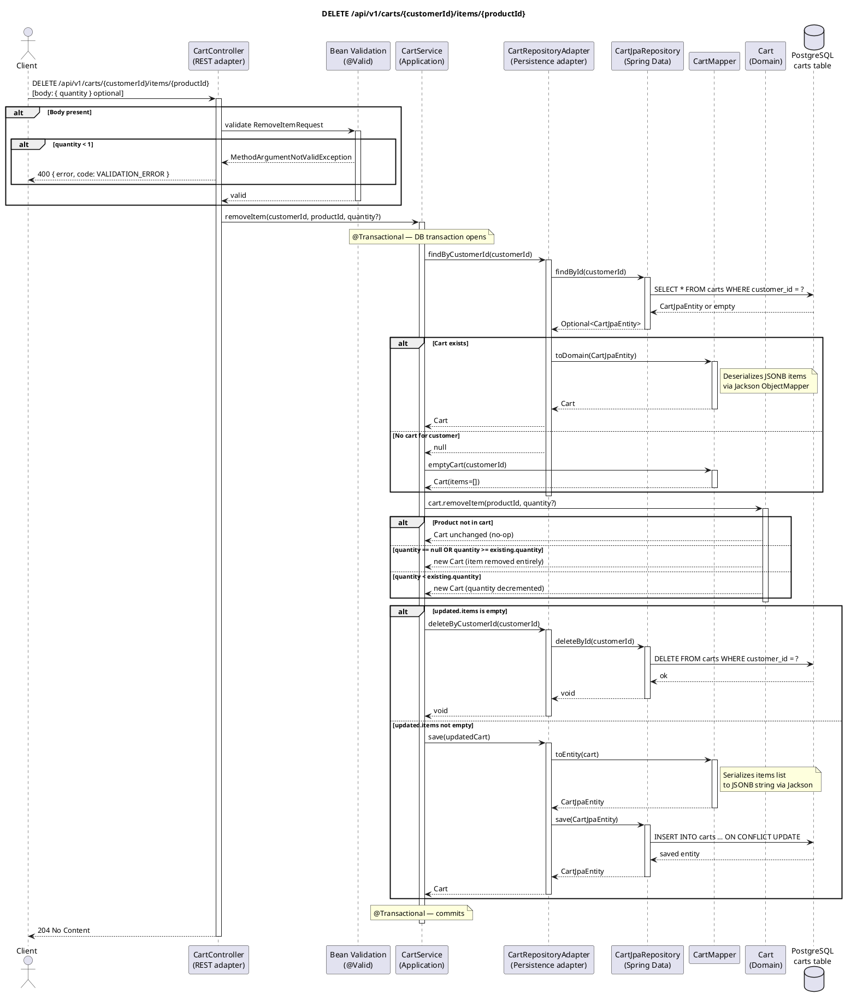

# DELETE /api/v1/carts/{customerId}/items/{productId} — Remove Item from Cart

## Overview

Removes a product from the customer's cart. Behaviour depends on whether `quantity` is provided in the optional request body:

- **No body / `quantity` omitted** — the entire `CartItem` is removed regardless of how many units are in the cart.
- **`quantity` provided and `quantity >= existing.quantity`** — the entire `CartItem` is removed.
- **`quantity` provided and `quantity < existing.quantity`** — the item's quantity is decremented.

If removing the item leaves the cart empty, **the cart row itself is deleted** from the database.
Always returns **204 No Content**.

---

## Request

| Part | Detail |
|------|--------|
| Method | `DELETE` |
| Path | `/api/v1/carts/{customerId}/items/{productId}` |
| Path params | `customerId` — UUID of the customer; `productId` — UUID of the product to remove |
| Content-Type | `application/json` (optional) |

**Body — `RemoveItemRequest` (optional):**

```json
{
  "quantity": 1
}
```

| Field | Type | Constraint |
|-------|------|-----------|
| `quantity` | Int? | `@Min(1)` (only validated when provided) |

Omitting the body entirely is valid and means "remove all units".

---

## Detailed Flow

### 1. HTTP layer — `CartController.removeItem()`

- Spring attempts to deserialize the body into `RemoveItemRequest?`. Because the parameter is annotated `@RequestBody(required = false)`, a missing body resolves to `null` without error.
- `@Valid` runs only when the body is present. If `quantity` is provided but less than 1, `MethodArgumentNotValidException` is thrown.
- The controller delegates to the inbound port:

```kotlin
cartUseCase.removeItem(customerId, productId, request?.quantity)
```

### 2. Application layer — `CartService.removeItem()` (`@Transactional`)

A Spring transaction is opened.

#### 2a. Load or create cart

```kotlin
val cart = cartRepository.findByCustomerId(customerId)
    ?: cartMapper.emptyCart(customerId)
```

Identical to the add-item flow: if no cart row exists, an in-memory empty `Cart` is returned. Operating on an empty cart is harmless — domain logic simply returns the same empty cart.

#### 2b. Outbound adapter — `CartRepositoryAdapter.findByCustomerId()`

Same as add-item: `SELECT * FROM carts WHERE customer_id = ?`, deserializes the JSONB `items` column if a row exists.

#### 2c. Domain logic — `Cart.removeItem()`

```kotlin
val updated = cart.removeItem(productId, quantity)
```

The domain model enforces the removal rules:

1. If `productId` is not in the cart → returns the cart unchanged (no-op, no exception).
2. If `quantity == null` or `quantity >= existing.quantity` → filters out the item entirely.
3. If `quantity < existing.quantity` → copies the item with `quantity - requested quantity`.

Returns a **new immutable `Cart`** with a refreshed `updatedAt`.

#### 2d. Persist or delete

```kotlin
if (updated.items.isEmpty()) {
    cartRepository.deleteByCustomerId(customerId)
} else {
    cartRepository.save(updated)
}
```

**Branch A — cart is now empty:**

- `CartRepositoryAdapter.deleteByCustomerId()` calls `CartJpaRepository.deleteById(customerId)`.
- Spring Data JPA issues `DELETE FROM carts WHERE customer_id = ?`.

**Branch B — cart still has items:**

- `CartRepositoryAdapter.save()` serializes the updated items list to JSONB and upserts via `CartJpaRepository.save()`.

Spring commits the transaction.

### 3. Response

The controller returns `ResponseEntity.noContent().build()` → **HTTP 204 No Content**.

---

## Error Handling

| Scenario | Exception | Handler | HTTP Response |
|----------|-----------|---------|---------------|
| `quantity` provided but < 1 | `MethodArgumentNotValidException` | `GlobalExceptionHandler.handleValidation()` | `400` `{"error": "quantity: must be greater than or equal to 1", "code": "VALIDATION_ERROR"}` |
| Product not in cart | *(no exception)* | — | `204` (silent no-op) |
| Customer has no cart | *(no exception)* | — | `204` (silent no-op — empty cart is created in memory and immediately discarded) |
| DB unreachable | `DataAccessException` (unchecked) | Not explicitly handled | `500 Internal Server Error` |

> **Note:** `CartNotFoundException` is defined in the domain but is **never thrown** in this flow.

---

## PlantUML Sequence Diagram


