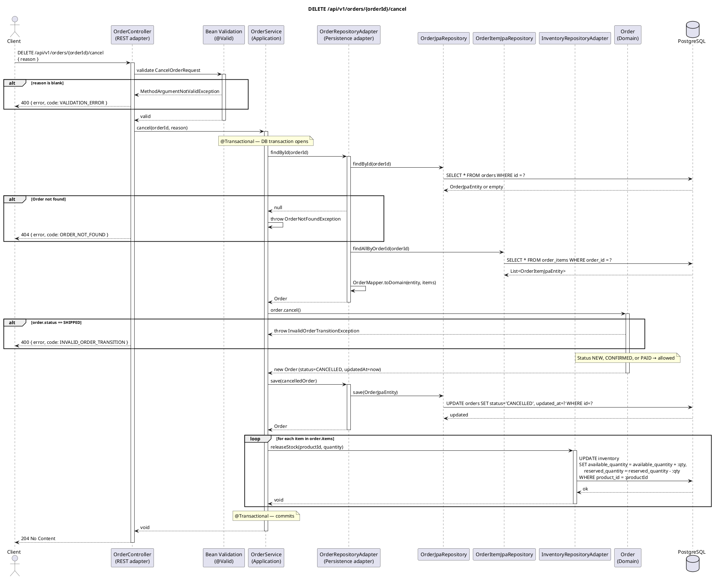

# DELETE /api/v1/orders/{orderId}/cancel — Cancel Order

## Overview

Cancels an order and **releases the reserved inventory** back to available stock. Cancellation is
allowed from `NEW`, `CONFIRMED`, or `PAID` — but **not** from `SHIPPED`. The domain model enforces
this restriction.

Unlike the other lifecycle transitions this endpoint uses the `DELETE` HTTP method and releases
inventory as a side-effect.

Returns **204 No Content**.

---

## Request

| Part | Detail |
|------|--------|
| Method | `DELETE` |
| Path | `/api/v1/orders/{orderId}/cancel` |
| Path param | `orderId` — UUID of the order to cancel |
| Content-Type | `application/json` |

**Body — `CancelOrderRequest`:**

```json
{
  "reason": "Customer changed mind"
}
```

| Field | Type | Constraint |
|-------|------|-----------|
| `reason` | String | `@NotBlank` |

---

## Detailed Flow

### 1. HTTP layer — `OrderController.cancel()`

- `@Valid` validates `CancelOrderRequest`. A blank `reason` raises `MethodArgumentNotValidException`.
- Delegates:

```kotlin
orderUseCase.cancel(orderId, request.reason)
```

### 2. Application layer — `OrderService.cancel()` (`@Transactional`)

#### 2a. Load order

`findOrThrow(orderId)` → `OrderRepositoryAdapter.findById()` → `SELECT orders` + `SELECT order_items`
→ `OrderMapper.toDomain()`. Throws `OrderNotFoundException` if missing.

#### 2b. Domain transition — `Order.cancel()`

```kotlin
val cancelled = order.cancel()
```

`Order.cancel()` applies a special rule (not the generic `transition()` helper):

```kotlin
fun cancel(): Order {
    if (status == OrderStatus.SHIPPED) throw InvalidOrderTransitionException(status, OrderStatus.CANCELLED)
    return copy(status = OrderStatus.CANCELLED, updatedAt = Instant.now())
}
```

- `SHIPPED` → throws `InvalidOrderTransitionException`.
- Any other status (`NEW`, `CONFIRMED`, `PAID`) → returns new `Order` with `status = CANCELLED`.

> **Note:** `reason` is passed to the service but the current `Order` domain model has no cancellation reason field. It is a forward-compatibility parameter.

#### 2c. Persist cancelled order

```kotlin
orderRepository.save(cancelled)
```

`UPDATE orders SET status = 'CANCELLED', updated_at = ? WHERE id = ?`

#### 2d. Release inventory

```kotlin
for (item in order.items) {
    inventoryRepository.releaseStock(item.productId, item.quantity)
}
```

`InventoryRepository.releaseStock()` reverses the reservation:

```sql
UPDATE inventory
SET available_quantity = available_quantity + :qty,
    reserved_quantity  = reserved_quantity  - :qty
WHERE product_id = :productId
```

This runs **once per order item**. There is no failure check on release — if the product no longer
has an inventory row, the UPDATE silently affects zero rows (stock was never negative).

Spring commits.

### 3. Response

**HTTP 204 No Content**.

---

## Order State Machine

```
NEW ──cancel()──► CANCELLED
CONFIRMED ──cancel()──► CANCELLED
PAID ──cancel()──► CANCELLED
SHIPPED ──cancel()──► ✗ InvalidOrderTransitionException (403 → 400)
```

---

## Error Handling

| Scenario | Exception | Handler | HTTP Response |
|----------|-----------|---------|---------------|
| `reason` is blank | `MethodArgumentNotValidException` | `GlobalExceptionHandler.handleValidation()` | `400` `{"error": "reason: must not be blank", "code": "VALIDATION_ERROR"}` |
| Order does not exist | `OrderNotFoundException` | `GlobalExceptionHandler.handleOrderNotFound()` | `404` `{"error": "Order not found: …", "code": "ORDER_NOT_FOUND"}` |
| Order is in `SHIPPED` status | `InvalidOrderTransitionException` | `GlobalExceptionHandler.handleInvalidTransition()` | `400` `{"error": "Invalid order status transition: SHIPPED -> CANCELLED", "code": "INVALID_ORDER_TRANSITION"}` |
| DB unreachable | `DataAccessException` | Not explicitly handled | `500 Internal Server Error` |

> **Transaction note:** If the `UPDATE orders` succeeds but the DB goes down mid-loop during
> `releaseStock`, Spring rolls back the status change too — the order remains in its pre-cancel
> status and inventory is consistent.

---

## PlantUML Sequence Diagram


