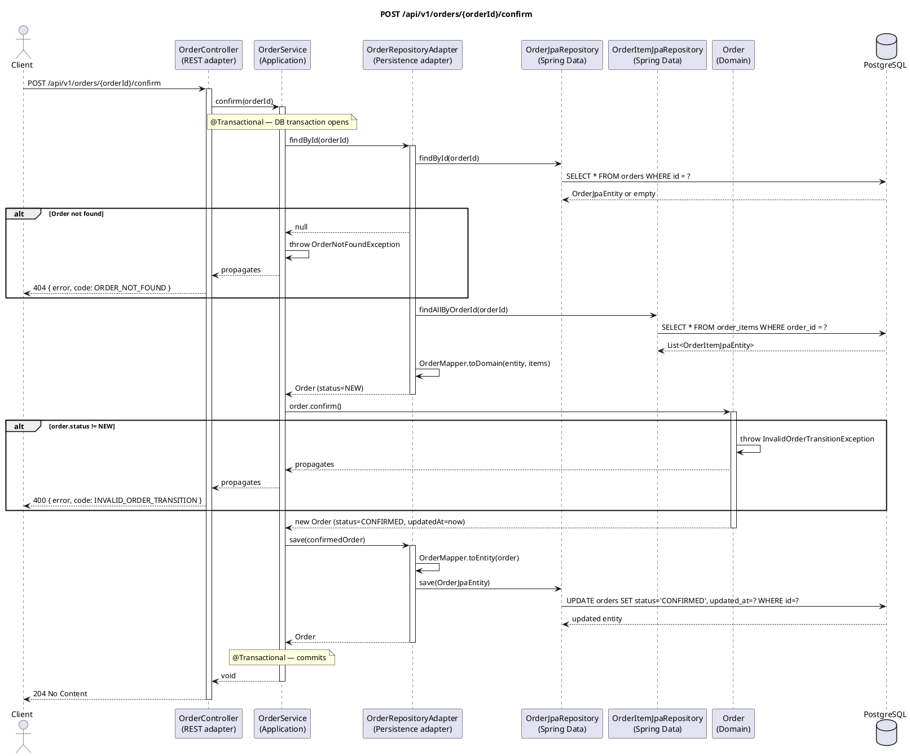

# POST /api/v1/orders/{orderId}/confirm — Confirm Order

## Overview

Advances an order from `NEW` to `CONFIRMED`. The transition is enforced by the domain model — if the
order is in any other status the request is rejected. No inventory changes occur at this step.

Returns **204 No Content**.

---

## Request

| Part | Detail |
|------|--------|
| Method | `POST` |
| Path | `/api/v1/orders/{orderId}/confirm` |
| Path param | `orderId` — UUID of the order to confirm |
| Body | None |

---

## Detailed Flow

### 1. HTTP layer — `OrderController.confirm()`

No body, no validation. The controller delegates immediately:

```kotlin
orderUseCase.confirm(orderId)
```

### 2. Application layer — `OrderService.confirm()` (`@Transactional`)

#### 2a. Load order

```kotlin
val order = findOrThrow(orderId)
```

`findOrThrow` calls `OrderRepository.findById()`. Inside `OrderRepositoryAdapter.findById()`:

1. `OrderJpaRepository.findById(orderId)` → `SELECT * FROM orders WHERE id = ?`
2. `OrderItemJpaRepository.findAllByOrderId(orderId)` → `SELECT * FROM order_items WHERE order_id = ?`
3. `OrderMapper.toDomain(entity, items)` assembles the domain `Order`.

If no row is found, `OrderNotFoundException` is thrown immediately.

#### 2b. Domain transition — `Order.confirm()`

```kotlin
orderRepository.save(order.confirm())
```

`Order.confirm()` (pure Kotlin, no I/O) calls `transition(OrderStatus.CONFIRMED, OrderStatus.NEW)`:

```kotlin
private fun transition(to: OrderStatus, vararg from: OrderStatus): Order {
    if (status !in from) throw InvalidOrderTransitionException(status, to)
    return copy(status = to, updatedAt = Instant.now())
}
```

- If `status == NEW` → returns a **new immutable `Order`** with `status = CONFIRMED` and a fresh `updatedAt`.
- If `status` is anything else → throws `InvalidOrderTransitionException`.

#### 2c. Persist

`OrderRepositoryAdapter.save(confirmedOrder)`:

1. `OrderMapper.toEntity()` builds an `OrderJpaEntity` with `status = CONFIRMED`.
2. `OrderJpaRepository.save()` → `UPDATE orders SET status = 'CONFIRMED', updated_at = ? WHERE id = ?`
3. Items already exist; the adapter skips `saveAll` for items that are already persisted (filters by existing IDs).

Spring commits.

### 3. Response

Controller returns `ResponseEntity.noContent().build()` → **HTTP 204 No Content**.

---

## Order State Machine

```
NEW ──confirm()──► CONFIRMED ──pay()──► PAID ──ship()──► SHIPPED
 │                     │                 │
 └──cancel()──┐  └──cancel()──┐  └──cancel()──┐
              ▼               ▼               ▼
           CANCELLED       CANCELLED       CANCELLED
```

This endpoint is only valid from `NEW`.

---

## Error Handling

| Scenario | Exception | Handler | HTTP Response |
|----------|-----------|---------|---------------|
| Order does not exist | `OrderNotFoundException` | `GlobalExceptionHandler.handleOrderNotFound()` | `404` `{"error": "Order not found: …", "code": "ORDER_NOT_FOUND"}` |
| Order is not in `NEW` status | `InvalidOrderTransitionException` | `GlobalExceptionHandler.handleInvalidTransition()` | `400` `{"error": "Invalid order status transition: X -> CONFIRMED", "code": "INVALID_ORDER_TRANSITION"}` |
| DB unreachable | `DataAccessException` | Not explicitly handled | `500 Internal Server Error` |

---

## PlantUML Sequence Diagram


