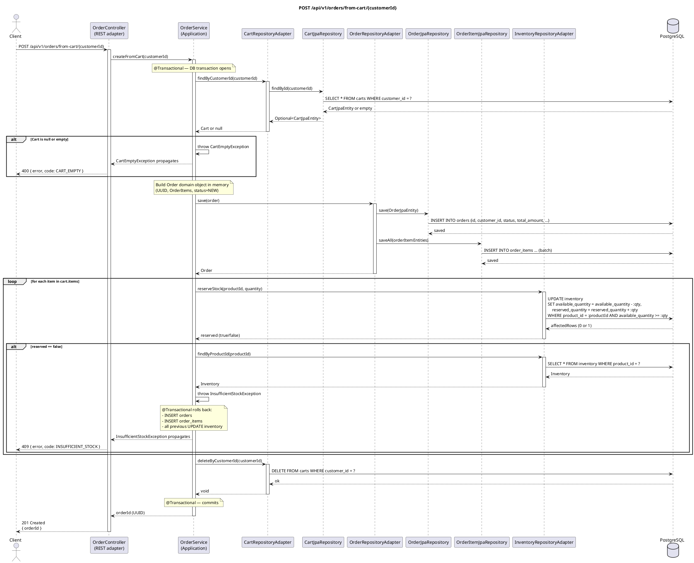

# POST /api/v1/orders/from-cart/{customerId} — Create Order from Cart

## Overview

The most complex flow in the system. Converts a customer's cart into a persisted `Order` and
reserves inventory for every item — all within a single transaction. The order is written to the
database **before** inventory is reserved; if any reservation fails, Spring rolls back the entire
transaction (order row + all item rows + any reservations that already succeeded).

Returns **201 Created** with the new order's UUID.

---

## Request

| Part | Detail |
|------|--------|
| Method | `POST` |
| Path | `/api/v1/orders/from-cart/{customerId}` |
| Path param | `customerId` — UUID of the customer whose cart will be converted |
| Body | None |

---

## Response — `CreateOrderResponse`

```json
{
  "orderId": "uuid"
}
```

---

## Detailed Flow

### 1. HTTP layer — `OrderController.createFromCart()`

No request body and no validation needed. The controller delegates directly:

```kotlin
val orderId = orderUseCase.createFromCart(customerId)
return ResponseEntity.status(HttpStatus.CREATED).body(CreateOrderResponse(orderId))
```

### 2. Application layer — `OrderService.createFromCart()` (`@Transactional`)

Spring opens a transaction. All database operations below participate in it.

#### 2a. Fetch and validate cart

```kotlin
val cart = cartRepository.findByCustomerId(customerId)
if (cart == null || cart.items.isEmpty()) throw CartEmptyException(customerId)
```

- `CartRepositoryAdapter.findByCustomerId()` issues `SELECT * FROM carts WHERE customer_id = ?`.
- If no cart exists or it has no items, `CartEmptyException` is thrown immediately — the transaction is rolled back and nothing is written.

#### 2b. Build the Order domain object in memory

```kotlin
val orderId = UUID.randomUUID()
val orderItems = cart.items.map { item ->
    OrderItem(id = UUID.randomUUID(), orderId = orderId, productId = item.productId,
              quantity = item.quantity, unitPrice = item.unitPrice)
}
val order = Order(
    id = orderId, customerId = customerId,
    status = OrderStatus.NEW, items = orderItems,
    totalAmount = cart.totalAmount, createdAt = now, updatedAt = now
)
```

Pure in-memory construction — no I/O yet.

#### 2c. Persist the order

```kotlin
orderRepository.save(order)
```

Inside `OrderRepositoryAdapter.save()`:

1. `OrderMapper.toEntity(order)` builds an `OrderJpaEntity` (without items).
2. `OrderJpaRepository.save(entity)` → `INSERT INTO orders …`
3. Each `OrderItem` becomes an `OrderItemJpaEntity` linked to the saved entity.
4. `OrderItemJpaRepository.saveAll(items)` → `INSERT INTO order_items …` (batch).

The order now exists in the DB with status `NEW`.

#### 2d. Reserve inventory — row-by-row

```kotlin
for (item in cart.items) {
    val reserved = inventoryRepository.reserveStock(item.productId, item.quantity)
    if (!reserved) {
        val inventory = inventoryRepository.findByProductId(item.productId)
        throw InsufficientStockException(item.productId, item.quantity, inventory?.availableQuantity ?: 0)
    }
}
```

`InventoryRepository.reserveStock()` executes a single atomic SQL statement:

```sql
UPDATE inventory
SET available_quantity = available_quantity - :qty,
    reserved_quantity  = reserved_quantity  + :qty
WHERE product_id = :productId
  AND available_quantity >= :qty
```

The **affected-row-count** is the guard: `1` means success, `0` means insufficient stock. If `0` is returned:

- `InsufficientStockException` is thrown.
- Spring's `@Transactional` intercepts the unchecked exception and **rolls back the transaction** — the `INSERT` on `orders`, all `INSERT`s on `order_items`, and every inventory `UPDATE` that already ran are all undone.
- The customer's cart is left untouched.

#### 2e. Clear the cart

```kotlin
cartRepository.deleteByCustomerId(customerId)
```

`DELETE FROM carts WHERE customer_id = ?` — runs only if all reservations succeeded.

### 3. Transaction commits

Spring commits. The order row, all item rows, and all inventory decrements become durable.

### 4. Response

Controller returns **201 Created** with `CreateOrderResponse(orderId)`.

---

## Error Handling

| Scenario | Exception | Handler | HTTP Response |
|----------|-----------|---------|---------------|
| Customer has no cart | `CartEmptyException` | `GlobalExceptionHandler.handleCartEmpty()` | `400` `{"error": "Cart is empty for customer: …", "code": "CART_EMPTY"}` |
| Cart exists but has no items | `CartEmptyException` | same | `400` CART_EMPTY |
| A product has insufficient stock | `InsufficientStockException` | `GlobalExceptionHandler.handleInsufficientStock()` | `409` `{"error": "Insufficient stock for product …: requested=N, available=M", "code": "INSUFFICIENT_STOCK"}` |
| DB unreachable | `DataAccessException` (unchecked) | Not explicitly handled | `500 Internal Server Error` |

> **Transaction rollback note:** `InsufficientStockException` is thrown inside the `@Transactional` boundary. Spring rolls back the order `INSERT`, all order-item `INSERT`s, and all inventory `UPDATE`s that already ran in the loop — the system returns to its pre-request state.

---

## PlantUML Sequence Diagram


