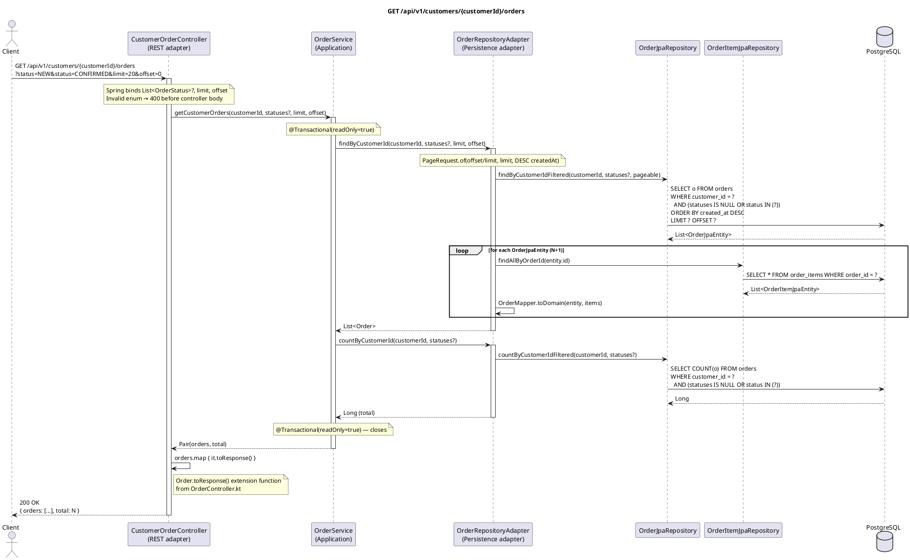

# GET /api/v1/customers/{customerId}/orders — List Customer Orders

## Overview

Returns a paginated list of orders for a specific customer. Results can be filtered by one or more
statuses and are always sorted newest-first (`created_at DESC`). The response includes a `total`
count for the unfiltered (but status-filtered) result set so clients can implement pagination.

Lives in `CustomerOrderController` — a separate controller from `OrderController`, scoped to the
`/api/v1/customers` namespace.

Returns **200 OK** with `OrderListResponse`.

---

## Request

| Part | Detail |
|------|--------|
| Method | `GET` |
| Path | `/api/v1/customers/{customerId}/orders` |
| Path param | `customerId` — UUID of the customer |
| Query param | `status` — `List<OrderStatus>` (optional, multi-value); e.g. `?status=NEW&status=CONFIRMED` |
| Query param | `limit` — Int (default `20`); page size |
| Query param | `offset` — Int (default `0`); number of records to skip |

---

## Response — `OrderListResponse`

```json
{
  "orders": [
    {
      "id": "uuid",
      "customerId": "uuid",
      "status": "CONFIRMED",
      "items": [ { "id": "uuid", "productId": "uuid", "quantity": 2, "unitPrice": 19.99 } ],
      "totalAmount": 39.98,
      "createdAt": "2024-01-15T10:30:00Z",
      "updatedAt": "2024-01-15T10:35:00Z"
    }
  ],
  "total": 7
}
```

| Field | Type | Description |
|-------|------|-------------|
| `orders` | `List<OrderResponse>` | Page of orders (up to `limit` entries) |
| `total` | Long | Total matching order count (ignores `limit`/`offset`; used for pagination UI) |

---

## Detailed Flow

### 1. HTTP layer — `CustomerOrderController.getCustomerOrders()`

Spring binds `status` as `List<OrderStatus>?` (multi-value query parameter), `limit`, and `offset`.
No `@Valid` annotation — invalid enum values result in a Spring type-conversion 400.

```kotlin
val (orders, total) = orderUseCase.getCustomerOrders(customerId, status, limit, offset)
return ResponseEntity.ok(
    OrderListResponse(orders = orders.map { it.toResponse() }, total = total)
)
```

Uses the same `Order.toResponse()` extension function defined in `OrderController.kt`.

### 2. Application layer — `OrderService.getCustomerOrders()` (`@Transactional(readOnly = true)`)

Two calls to the outbound port are made:

```kotlin
val orders = orderRepository.findByCustomerId(customerId, statuses, limit, offset)
val total  = orderRepository.countByCustomerId(customerId, statuses)
return Pair(orders, total)
```

- `findByCustomerId` fetches the current page.
- `countByCustomerId` fetches the total count for pagination metadata.

### 3. Outbound adapter — `OrderRepositoryAdapter.findByCustomerId()`

```kotlin
val pageable = PageRequest.of(offset / limit, limit, Sort.by(Sort.Direction.DESC, "createdAt"))
return orderJpaRepository.findByCustomerIdFiltered(customerId, statuses, pageable)
    .map { entity ->
        val items = orderItemJpaRepository.findAllByOrderId(entity.id)
        OrderMapper.toDomain(entity, items)
    }
```

**Pagination:** `offset / limit` converts row-based offset to a page number for Spring's `Pageable`.
Note: this truncates if `offset` is not a multiple of `limit`.

**N+1 pattern:** For each order in the page, a separate `SELECT * FROM order_items WHERE order_id = ?`
is issued. With `limit=20` this means up to 21 queries (1 for orders + 20 for items).

**JPQL query** (`findByCustomerIdFiltered`):

```sql
SELECT o FROM OrderJpaEntity o
WHERE o.customerId = :customerId
  AND (:#{#statuses == null} = true OR o.status IN :statuses)
ORDER BY o.createdAt DESC
```

The SpEL expression `:#{#statuses == null} = true` makes the status filter optional.

### 4. Outbound adapter — `OrderRepositoryAdapter.countByCustomerId()`

```sql
SELECT COUNT(o) FROM OrderJpaEntity o
WHERE o.customerId = :customerId
  AND (:#{#statuses == null} = true OR o.status IN :statuses)
```

Returns a `Long`. Uses the same optional-status pattern.

### 5. Response mapping

Each `Order` is mapped to `OrderResponse` via `Order.toResponse()`, then wrapped in
`OrderListResponse(orders, total)`.

---

## Error Handling

| Scenario | Exception | Handler | HTTP Response |
|----------|-----------|---------|---------------|
| Invalid `status` value | Spring type-conversion error | Not explicitly handled | `400 Bad Request` |
| Customer has no orders | *(no exception)* | — | `200` `{"orders": [], "total": 0}` |
| `offset` not a multiple of `limit` | *(no exception — page truncation)* | — | `200` with potentially unexpected page |
| DB unreachable | `DataAccessException` | Not explicitly handled | `500 Internal Server Error` |

---

## PlantUML Sequence Diagram


