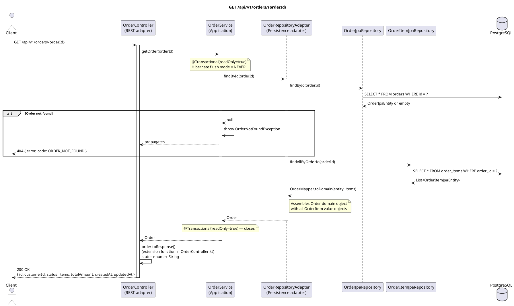

# GET /api/v1/orders/{orderId} — Get Order by ID

## Overview

Retrieves full details of a single order including all its line items. Uses a read-only transaction.
Returns **200 OK** with `OrderResponse`, or **404** if the order does not exist.

---

## Request

| Part | Detail |
|------|--------|
| Method | `GET` |
| Path | `/api/v1/orders/{orderId}` |
| Path param | `orderId` — UUID of the order |
| Body | None |

---

## Response — `OrderResponse`

```json
{
  "id": "uuid",
  "customerId": "uuid",
  "status": "CONFIRMED",
  "items": [
    {
      "id": "uuid",
      "productId": "uuid",
      "quantity": 2,
      "unitPrice": 19.99
    }
  ],
  "totalAmount": 39.98,
  "createdAt": "2024-01-15T10:30:00Z",
  "updatedAt": "2024-01-15T10:35:00Z"
}
```

| Field | Type | Description |
|-------|------|-------------|
| `id` | UUID | Order identifier |
| `customerId` | UUID | Owning customer |
| `status` | String | One of `NEW`, `CONFIRMED`, `PAID`, `SHIPPED`, `CANCELLED` |
| `items` | `List<OrderItemDto>` | All line items (id, productId, quantity, unitPrice) |
| `totalAmount` | BigDecimal | Sum captured at order creation (not recalculated) |
| `createdAt` | Instant | When the order was created |
| `updatedAt` | Instant | When the order was last modified |

---

## Detailed Flow

### 1. HTTP layer — `OrderController.getOrder()`

No validation needed. Delegates:

```kotlin
val order = orderUseCase.getOrder(orderId)
return ResponseEntity.ok(order.toResponse())
```

### 2. Application layer — `OrderService.getOrder()` (`@Transactional(readOnly = true)`)

A read-only transaction is opened (Hibernate flush mode = NEVER, no dirty-checking overhead).

```kotlin
return findOrThrow(orderId)
```

If the order is not found, `OrderNotFoundException` is thrown.

### 3. Outbound adapter — `OrderRepositoryAdapter.findById()`

Two queries are always issued:

```kotlin
val entity = orderJpaRepository.findById(id).orElse(null) ?: return null
val items  = orderItemJpaRepository.findAllByOrderId(id)
return OrderMapper.toDomain(entity, items)
```

**Query 1 — order row:**

```sql
SELECT * FROM orders WHERE id = ?
```

**Query 2 — item rows:**

```sql
SELECT * FROM order_items WHERE order_id = ?
```

`OrderMapper.toDomain()` assembles the domain object:

```kotlin
Order(
    id = entity.id,
    customerId = entity.customerId,
    status = entity.status,        // OrderStatus enum
    items = items.map { OrderItem(it.id, it.order.id, it.productId, it.quantity, it.unitPrice) },
    totalAmount = entity.totalAmount,
    createdAt = entity.createdAt,
    updatedAt = entity.updatedAt
)
```

### 4. Response mapping — `Order.toResponse()` (extension function in `OrderController.kt`)

Back in the controller, the extension function converts the domain model to the DTO:

```kotlin
fun Order.toResponse() = OrderResponse(
    id = id,
    customerId = customerId,
    status = status.name,          // enum → String
    items = items.map { OrderItemDto(it.id, it.productId, it.quantity, it.unitPrice) },
    totalAmount = totalAmount,
    createdAt = createdAt,
    updatedAt = updatedAt
)
```

Note: `status` is serialised as its name string, not the enum value.

### 5. Response

Controller returns **200 OK** with the `OrderResponse` JSON body.

---

## Error Handling

| Scenario | Exception | Handler | HTTP Response |
|----------|-----------|---------|---------------|
| Order does not exist | `OrderNotFoundException` | `GlobalExceptionHandler.handleOrderNotFound()` | `404` `{"error": "Order not found: …", "code": "ORDER_NOT_FOUND"}` |
| DB unreachable | `DataAccessException` | Not explicitly handled | `500 Internal Server Error` |

---

## PlantUML Sequence Diagram


