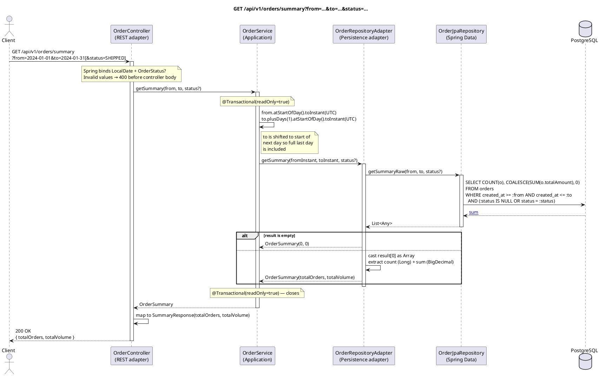

# GET /api/v1/orders/summary — Get Order Summary

## Overview

Returns aggregated order statistics for a date range: total order count and total monetary volume.
An optional `status` filter limits the aggregation to orders in a specific state. Dates are passed as
`LocalDate` query parameters and converted to UTC `Instant` range boundaries in the service.

Uses a read-only transaction and a single aggregate SQL query — no order rows are loaded into memory.

Returns **200 OK** with `SummaryResponse`.

---

## Request

| Part | Detail |
|------|--------|
| Method | `GET` |
| Path | `/api/v1/orders/summary` |
| Query param | `from` — `LocalDate` (e.g. `2024-01-01`), inclusive |
| Query param | `to` — `LocalDate` (e.g. `2024-01-31`), inclusive |
| Query param | `status` — `OrderStatus` (optional); one of `NEW`, `CONFIRMED`, `PAID`, `SHIPPED`, `CANCELLED` |

---

## Response — `SummaryResponse`

```json
{
  "totalOrders": 42,
  "totalVolume": 8399.58
}
```

| Field | Type | Description |
|-------|------|-------------|
| `totalOrders` | Long | Count of orders in the date range (optionally filtered by status) |
| `totalVolume` | BigDecimal | Sum of `total_amount` across matching orders; `0` if no orders match |

---

## Detailed Flow

### 1. HTTP layer — `OrderController.getSummary()`

Spring binds the query parameters directly to `LocalDate` and `OrderStatus?`. No `@Valid` annotation
is present — invalid date formats or unknown status strings result in a Spring type-conversion error
(400 Bad Request) handled at the framework level before the controller body runs.

```kotlin
val summary = orderUseCase.getSummary(from, to, status)
return ResponseEntity.ok(SummaryResponse(summary.totalOrders, summary.totalVolume))
```

### 2. Application layer — `OrderService.getSummary()` (`@Transactional(readOnly = true)`)

#### 2a. Date → Instant conversion

```kotlin
val fromInstant = from.atStartOfDay().toInstant(ZoneOffset.UTC)      // e.g. 2024-01-01T00:00:00Z
val toInstant   = to.plusDays(1).atStartOfDay().toInstant(ZoneOffset.UTC)  // e.g. 2024-02-01T00:00:00Z
```

`to` is converted to the **start of the next day** so the upper boundary is exclusive and the full
last day is included (i.e. `createdAt < to+1day` covers all of `to`).

#### 2b. Delegate to repository

```kotlin
return orderRepository.getSummary(fromInstant, toInstant, status)
```

### 3. Outbound adapter — `OrderRepositoryAdapter.getSummary()`

```kotlin
val result = orderJpaRepository.getSummaryRaw(from, to, status)
if (result.isEmpty()) return OrderSummary(0L, BigDecimal.ZERO)
val row = result[0] as Array<*>
return OrderSummary(
    totalOrders = row[0] as Long,
    totalVolume = (row[1] as? BigDecimal) ?: BigDecimal.ZERO
)
```

### 4. Database query — `OrderJpaRepository.getSummaryRaw()`

```sql
SELECT COUNT(o), COALESCE(SUM(o.totalAmount), 0)
FROM OrderJpaEntity o
WHERE o.createdAt >= :from
  AND o.createdAt <= :to
  AND (:#{#status == null} = true OR o.status = :status)
```

- `COUNT(o)` — number of matching orders.
- `COALESCE(SUM(o.totalAmount), 0)` — total volume; `COALESCE` returns `0` when no rows match.
- The status clause uses a JPQL SpEL trick: `:#{#status == null} = true` short-circuits the filter
  when `status` is `null`, making the parameter truly optional.
- Returns a `List<Any>` where `result[0]` is an `Array<*>` of `[Long, BigDecimal]`.

### 5. Response mapping

`OrderSummary` (defined in the `OrderUseCase` port interface) is directly projected onto
`SummaryResponse` by the controller.

---

## Error Handling

| Scenario | Exception | Handler | HTTP Response |
|----------|-----------|---------|---------------|
| `from` or `to` is not a valid date | Spring `MethodArgumentTypeMismatchException` | Not explicitly handled — Spring returns `400` | `400 Bad Request` (no custom body) |
| `status` is not a valid `OrderStatus` value | Spring `MethodArgumentTypeMismatchException` | Not explicitly handled | `400 Bad Request` (no custom body) |
| No orders match the filter | *(no exception)* | — | `200` `{"totalOrders": 0, "totalVolume": 0}` |
| DB unreachable | `DataAccessException` | Not explicitly handled | `500 Internal Server Error` |

---

## PlantUML Sequence Diagram


