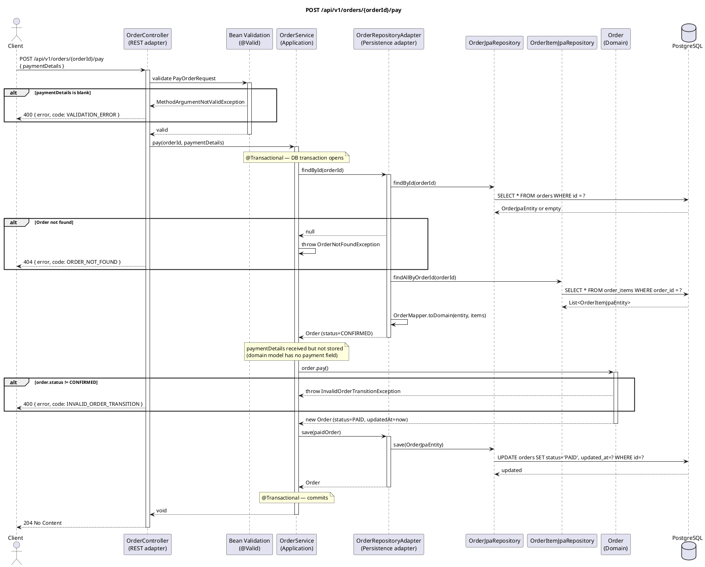

# POST /api/v1/orders/{orderId}/pay — Pay for Order

## Overview

Advances an order from `CONFIRMED` to `PAID`. The domain model enforces the required predecessor
status. `paymentDetails` is accepted in the request body and passed through to the use case,
but the current domain model stores no payment data — the field is reserved for future integration.

Returns **204 No Content**.

---

## Request

| Part | Detail |
|------|--------|
| Method | `POST` |
| Path | `/api/v1/orders/{orderId}/pay` |
| Path param | `orderId` — UUID of the order to pay |
| Content-Type | `application/json` |

**Body — `PayOrderRequest`:**

```json
{
  "paymentDetails": "card_token_abc123"
}
```

| Field | Type | Constraint |
|-------|------|-----------|
| `paymentDetails` | String | `@NotBlank` |

---

## Detailed Flow

### 1. HTTP layer — `OrderController.pay()`

- `@Valid` validates `PayOrderRequest`. If `paymentDetails` is blank, `MethodArgumentNotValidException` is thrown before the controller body runs.
- Delegates to the use case:

```kotlin
orderUseCase.pay(orderId, request.paymentDetails)
```

### 2. Application layer — `OrderService.pay()` (`@Transactional`)

#### 2a. Load order

Identical to the confirm flow: `findOrThrow(orderId)` calls `OrderRepositoryAdapter.findById()`,
which runs two queries (`SELECT orders` + `SELECT order_items`) and assembles the domain `Order`
via `OrderMapper.toDomain()`. Throws `OrderNotFoundException` if not found.

#### 2b. Domain transition — `Order.pay()`

```kotlin
orderRepository.save(order.pay())
```

`Order.pay()` calls `transition(OrderStatus.PAID, OrderStatus.CONFIRMED)`:

- If `status == CONFIRMED` → returns new immutable `Order` with `status = PAID`, `updatedAt = now`.
- Otherwise → throws `InvalidOrderTransitionException`.

> **Note:** `paymentDetails` is received by the service but is not stored anywhere in the current implementation. The domain `Order` model has no payment field. The parameter is a placeholder for a future payment-gateway integration.

#### 2c. Persist

`OrderRepositoryAdapter.save()` → `UPDATE orders SET status = 'PAID', updated_at = ? WHERE id = ?`

Spring commits.

### 3. Response

**HTTP 204 No Content**.

---

## Order State Machine

```
NEW ──confirm()──► CONFIRMED ──pay()──► PAID ──ship()──► SHIPPED
                       │                 │
                  cancel()           cancel()
                       │                 │
                       ▼                 ▼
                   CANCELLED         CANCELLED
```

This endpoint is only valid from `CONFIRMED`.

---

## Error Handling

| Scenario | Exception | Handler | HTTP Response |
|----------|-----------|---------|---------------|
| `paymentDetails` is blank | `MethodArgumentNotValidException` | `GlobalExceptionHandler.handleValidation()` | `400` `{"error": "paymentDetails: must not be blank", "code": "VALIDATION_ERROR"}` |
| Order does not exist | `OrderNotFoundException` | `GlobalExceptionHandler.handleOrderNotFound()` | `404` `{"error": "Order not found: …", "code": "ORDER_NOT_FOUND"}` |
| Order is not in `CONFIRMED` status | `InvalidOrderTransitionException` | `GlobalExceptionHandler.handleInvalidTransition()` | `400` `{"error": "Invalid order status transition: X -> PAID", "code": "INVALID_ORDER_TRANSITION"}` |
| DB unreachable | `DataAccessException` | Not explicitly handled | `500 Internal Server Error` |

---

## PlantUML Sequence Diagram


