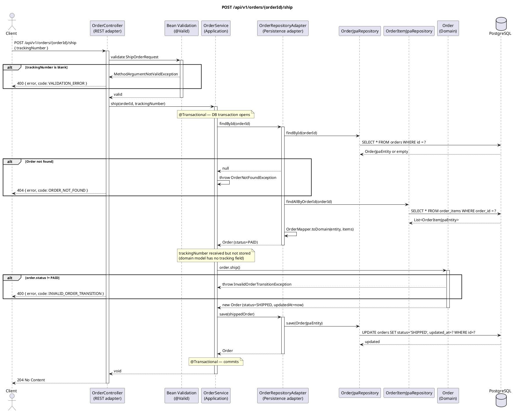

# POST /api/v1/orders/{orderId}/ship — Ship Order

## Overview

Advances an order from `PAID` to `SHIPPED`. This is the **terminal successful state** — once shipped,
an order can no longer be cancelled. The `trackingNumber` is accepted but not stored in the current
domain model; it is a placeholder for a future logistics integration.

Returns **204 No Content**.

---

## Request

| Part | Detail |
|------|--------|
| Method | `POST` |
| Path | `/api/v1/orders/{orderId}/ship` |
| Path param | `orderId` — UUID of the order to ship |
| Content-Type | `application/json` |

**Body — `ShipOrderRequest`:**

```json
{
  "trackingNumber": "DHL-123456789"
}
```

| Field | Type | Constraint |
|-------|------|-----------|
| `trackingNumber` | String | `@NotBlank` |

---

## Detailed Flow

### 1. HTTP layer — `OrderController.ship()`

- `@Valid` validates `ShipOrderRequest`. A blank `trackingNumber` raises `MethodArgumentNotValidException`.
- Delegates to the use case:

```kotlin
orderUseCase.ship(orderId, request.trackingNumber)
```

### 2. Application layer — `OrderService.ship()` (`@Transactional`)

#### 2a. Load order

`findOrThrow(orderId)` → `OrderRepositoryAdapter.findById()` → two SELECT queries (orders + order_items)
→ `OrderMapper.toDomain()`. Throws `OrderNotFoundException` if not found.

#### 2b. Domain transition — `Order.ship()`

```kotlin
orderRepository.save(order.ship())
```

`Order.ship()` calls `transition(OrderStatus.SHIPPED, OrderStatus.PAID)`:

- If `status == PAID` → returns new immutable `Order` with `status = SHIPPED`, `updatedAt = now`.
- Otherwise → throws `InvalidOrderTransitionException`.

> **Note:** `trackingNumber` is passed to the service but the current `Order` domain model carries no tracking field. The parameter is a forward-compatibility hook for a future logistics adapter.

#### 2c. Persist

`OrderRepositoryAdapter.save()` → `UPDATE orders SET status = 'SHIPPED', updated_at = ? WHERE id = ?`

Spring commits.

### 3. Response

**HTTP 204 No Content**.

---

## Order State Machine

```
NEW ──confirm()──► CONFIRMED ──pay()──► PAID ──ship()──► SHIPPED
                                                           (terminal — cannot cancel)
```

This endpoint is only valid from `PAID`. After shipping, `cancel()` will throw
`InvalidOrderTransitionException` because `SHIPPED` is explicitly excluded from cancellation.

---

## Error Handling

| Scenario | Exception | Handler | HTTP Response |
|----------|-----------|---------|---------------|
| `trackingNumber` is blank | `MethodArgumentNotValidException` | `GlobalExceptionHandler.handleValidation()` | `400` `{"error": "trackingNumber: must not be blank", "code": "VALIDATION_ERROR"}` |
| Order does not exist | `OrderNotFoundException` | `GlobalExceptionHandler.handleOrderNotFound()` | `404` `{"error": "Order not found: …", "code": "ORDER_NOT_FOUND"}` |
| Order is not in `PAID` status | `InvalidOrderTransitionException` | `GlobalExceptionHandler.handleInvalidTransition()` | `400` `{"error": "Invalid order status transition: X -> SHIPPED", "code": "INVALID_ORDER_TRANSITION"}` |
| DB unreachable | `DataAccessException` | Not explicitly handled | `500 Internal Server Error` |

---

## PlantUML Sequence Diagram


